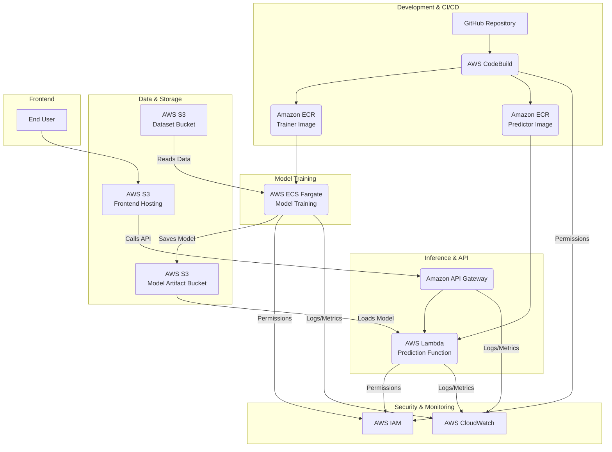

# 🏛️ Project Architecture

This project is composed of several key AWS services working together in two main phases: a CI/CD and Model Training pipeline, and a Serverless Inference pipeline. The diagram below illustrates the complete end-to-end workflow.

## Component Breakdown

*   **Code:** Source code (`lambda_function.py`, `train.py`) and configuration (`Dockerfile`, `buildspec.yml`) is stored in **GitHub**.
*   **Storage:** The dataset and trained model artifact (`.joblib` file) are stored in **AWS S3**.
*   **Model Training:** A containerized script is run as a one-off task on **AWS ECS Fargate** to train the model and save the artifact to S3.
*   **CI/CD Pipeline:** A push to GitHub triggers **AWS CodeBuild**, which builds a container image for the Lambda function and pushes it to **Amazon ECR**.
*   **Serverless Inference:** **AWS Lambda** runs the container from ECR, serving predictions.
*   **API Layer:** **Amazon API Gateway** provides a public HTTP endpoint that triggers the Lambda function.
*   **Frontend:** A static website (HTML/CSS/JS) is hosted in an **AWS S3** bucket.